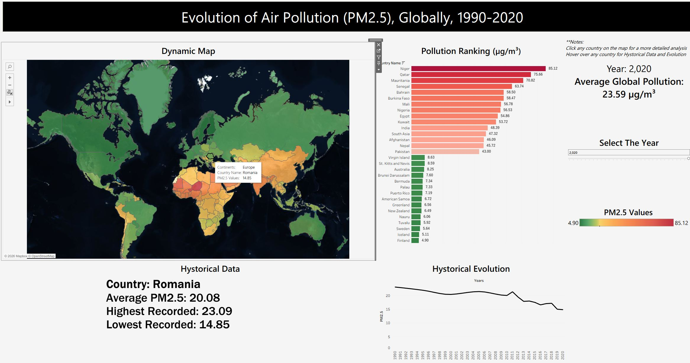

# 🌍 Global Air Pollution Evolution (PM2.5): 1990–2020

An interactive data visualization and analytics dashboard project created by students at the **🏛️ Bucharest University of Economic Studies (ASE)**. This project leverages historical environmental records to analyze global trends, regional disparities, and country-level developments in air quality over a 30-year period.

🔗 **Dashboard Link:**  
https://public.tableau.com/app/profile/constantin.teodor/viz/AirPollution_17811098062940/Dashboard1



---

## 👥 Project Contributors

- 👨‍🎓 Constantin Teodor-Vasile
- 👩‍🎓 Erhan Teodora-Miruna
- 👨‍🎓 Nițu Vlad-Cristian

---

# 📌 Context & Importance

### 🌫️ Public Health Crisis

Air pollution remains one of the most significant environmental and public health challenges worldwide.

Fine particulate matter (**PM2.5**) is particularly dangerous because it can penetrate deep into the lungs and bloodstream, contributing to:

- 🫁 Respiratory diseases
- ❤️ Cardiovascular diseases
- 🏥 Increased hospitalization rates
- ⚰️ Premature mortality

### 🎯 Project Objective

Analyze and visualize the evolution of global PM2.5 concentrations between **1990 and 2020** in order to:

- 🌍 Identify global pollution trends
- 📈 Monitor long-term air quality changes
- 🔥 Detect persistent pollution hotspots
- 🏛️ Support evidence-based environmental policymaking

### 👥 Target Audience

- 🏥 Public Health Analysts
- 🌱 Environmental Researchers
- 🏛️ Policy Makers
- 📊 Data Analysts
- 🌍 Citizens interested in environmental protection

---

# ❓ Key Analytical Questions

### 1️⃣ Global Evolution

How has air pollution evolved globally over the last three decades?

### 2️⃣ Regional Differences

Are there significant differences in pollution levels between continents and world regions?

### 3️⃣ Pollution Hotspots

Which countries remain the most affected by hazardous PM2.5 concentrations?

---

# 📊 Dataset Specifications

| Category | Details |
|-----------|----------|
| 🌫️ Metric | PM2.5 Annual Mean Concentration |
| 📏 Unit | μg/m³ |
| 📅 Period | 1990–2020 |
| ⏳ Coverage | 30 Years |
| 🌍 Granularity | Country-Level |
| 🗺️ Aggregation | Continental & Global Regions |

---

# 🖼️ Dashboard Architecture

The dashboard follows a modular design philosophy, allowing users to progressively explore information from high-level indicators to detailed geographical insights.

---

## 1️⃣ High-Level Metrics (BANs)

### 📊 Big Angry Numbers (BAN)

Quick overview indicators displaying:

- 📈 Global Average PM2.5
- 📉 Minimum PM2.5 Value
- 🔥 Maximum PM2.5 Value

These KPIs provide immediate situational awareness.

---

## 2️⃣ Analytical & Spatial Visualizations

### 🌍 Global Continental Map

A geospatial representation of PM2.5 concentrations across countries worldwide.

**Purpose:**

- Identify pollution hotspots
- Compare regions geographically
- Detect spatial patterns

---

### 📈 Temporal Trend Line

Displays the relationship between:

- 📅 Year
- 🌫️ Global Average PM2.5

**Purpose:**

- Track long-term pollution trends
- Detect periods of improvement or deterioration

---

### 📊 Continental Comparison Bar Chart

Breaks down pollution levels across continents.

**Purpose:**

- Compare regional air quality
- Highlight continental disparities

---

### 🔥 Top 15 Most Polluted Countries

Ranks countries with the highest PM2.5 concentrations.

**Purpose:**

- Identify high-risk regions
- Track persistent environmental challenges

---

### 🌱 Top 15 Least Polluted Countries

Ranks countries with the lowest PM2.5 concentrations.

**Purpose:**

- Highlight successful environmental performance
- Provide benchmarking opportunities

---

# 🎨 Visualization & UX Principles

The dashboard was developed following the **"Less is More"** design philosophy.

---

## ✅ Clarity First

- Clear chart titles
- Explicit units of measurement
- Intuitive visual hierarchy
- Easily interpretable graphics

---

## 🎨 Strategic Color Coding

Heatmaps and gradients are used to:

- 🟢 Highlight cleaner regions
- 🔴 Emphasize pollution hotspots
- 👀 Direct user attention toward critical values

---

## ⚫ High Visual Contrast

Design choices include:

- Clean white backgrounds
- Dark text elements
- Minimal visual clutter

This reduces cognitive load and improves readability.

---

## 🔍 Progressive Disclosure

Interactive Tableau actions reveal additional information only when needed.

Benefits:

- Cleaner interface
- Faster navigation
- Improved user experience

---

# 📈 Key Analytical Findings (1990–2020)

---

## 🔥 Persistent Global Hotspots

Several countries consistently ranked among the world's most polluted nations.

### Notable Examples

- 🇶🇦 Qatar
- 🇳🇪 Niger

These countries remained near the top of PM2.5 rankings throughout much of the observed period.

---

## 🌱 Stable Low-Pollution Regions

Several regions maintained consistently low pollution levels.

### Examples

- 🇸🇪 Scandinavia
- 🇨🇦 North America
- 🇦🇺 Australia
- 🌎 Parts of Latin America

These regions demonstrated stable environmental performance over time.

---

## 🇪🇺 European Air Quality Transition

Many European countries experienced significant reductions in PM2.5 concentrations.

### Key Outcome

- 📉 Historical pollution levels decreased substantially
- 🌱 Air quality improved steadily
- 🏛️ Environmental regulations appear to have contributed positively

---

## 📉 Major Improvements in South America

### 🇵🇪 Peru

PM2.5 concentrations declined dramatically.

### 🇧🇴 Bolivia

Similar downward trajectory observed.

#### Approximate Evolution

```text
~80 μg/m³
      ↓
~22 μg/m³
```

These represent some of the strongest improvements in the dataset.

---

## 🌏 The Asian Context

Many Asian countries displayed encouraging trends until approximately 2010.

### Phase 1 (1990–2010)

📉 Declining or stable pollution levels

### Phase 2 (2010–2020)

📈 Rapid increase in PM2.5 concentrations

Potential drivers include:

- Industrial expansion 🏭
- Urbanization 🏙️
- Increased transportation activity 🚗

---

# 📊 Dashboard Insights Summary

### 🌍 Global Perspective

- Air pollution remains unevenly distributed worldwide.
- Significant regional disparities persist.

### 🇪🇺 Europe

- Strong environmental progress observed.

### 🌏 Asia

- Increasing concerns during the last decade.

### 🌎 Latin America

- Several countries achieved substantial improvements.

### 🔥 Persistent Hotspots

- Qatar and Niger remain among the most affected nations.

---

# 🛠️ Technologies Used

### 📊 Data Visualization

- Tableau Public

### 📈 Analytics

- Descriptive Statistical Analysis
- Comparative Regional Analysis
- Time Series Exploration

### 🌍 Geospatial Analysis

- Interactive Geographic Mapping
- Country-Level Spatial Visualization

---

# 🚀 Dashboard Features

✅ Interactive Filters  
✅ Dynamic Country Selection  
✅ Geographic Exploration  
✅ Historical Trend Analysis  
✅ Continental Comparisons  
✅ Pollution Hotspot Detection  
✅ Responsive Data Storytelling

---

# 🌱 Impact

This project demonstrates how interactive analytics dashboards can transform large environmental datasets into actionable insights for:

- 🏛️ Policy Development
- 🌍 Environmental Monitoring
- 🏥 Public Health Planning
- 📊 Data-Driven Decision Making

By making historical pollution data accessible and intuitive, the dashboard supports greater awareness of long-term environmental challenges and progress.

---

⭐ **Main Contribution:** Development of an interactive Tableau dashboard that reveals global, regional, and national PM2.5 pollution trends between 1990 and 2020, helping users identify environmental progress, persistent hotspots, and long-term air quality patterns through intuitive visual analytics.
